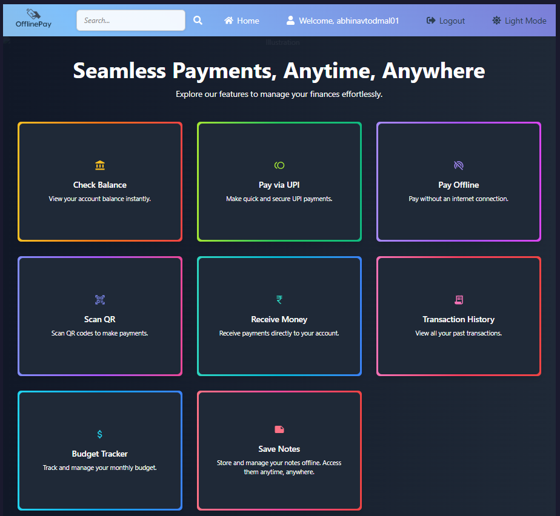
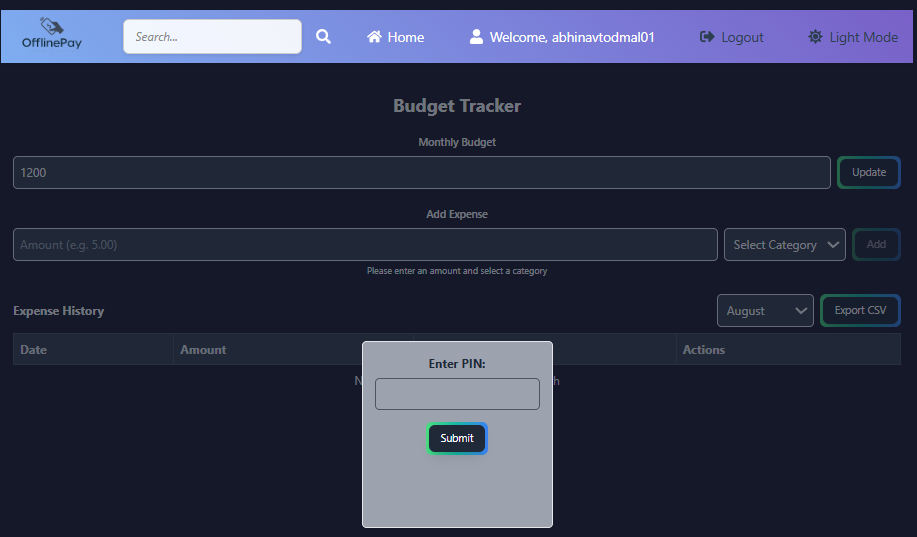
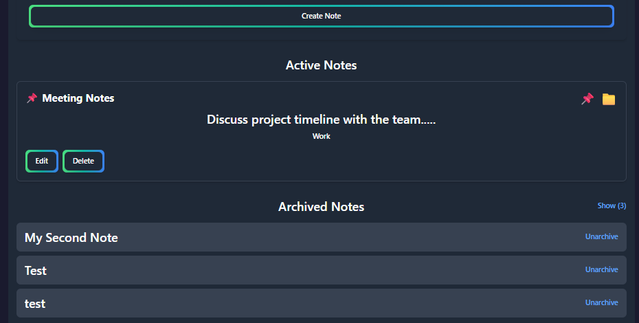
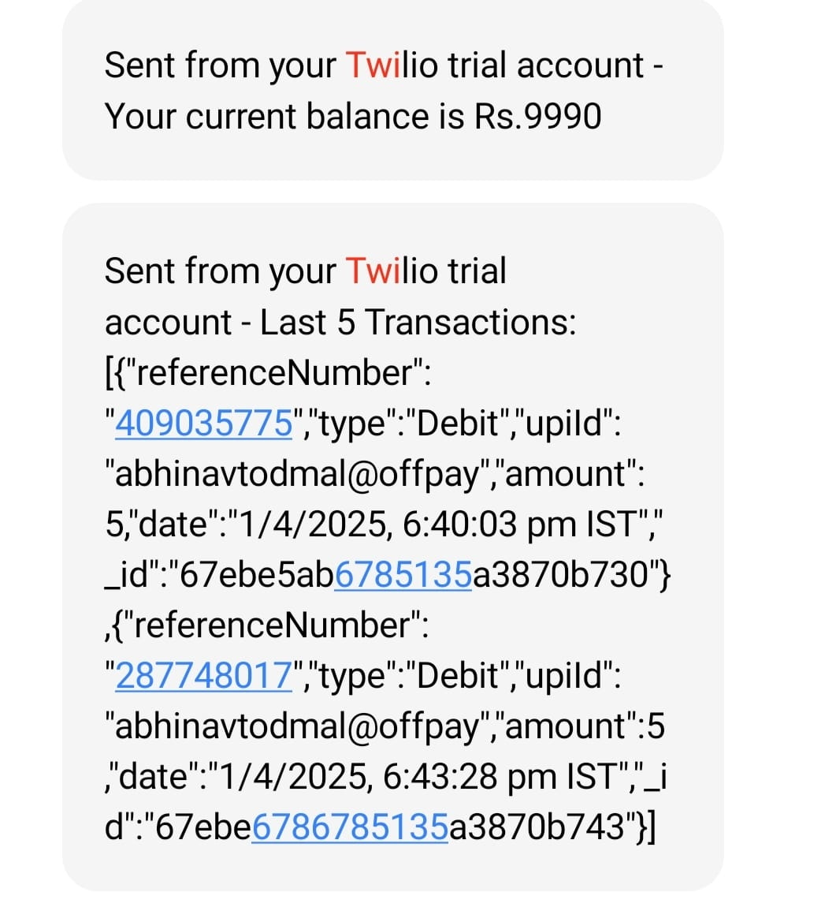

# 💳 OfflinePay - Seamless Payments, Anytime, Anywhere

  
  
  
  
  

## 📌 Overview

OfflinePay is like a digital cheque book for your phone.

Write a "cheque" (create a payment) offline. It stays secure on your device. When you're back online, it automatically clears and you get a confirmation—just like a bank processing a cheque.

No internet? No problem. Pay anytime, anywhere.

---

## ✨ Key Features

  <table>
    <tr>
      <th></th>
      <th></th> 
      <th></th>
    </tr>
    <tr>
      <td>
        • 💸 Send & Receive Money 
        • 📱 UPI & QR Code Payments 
        • 📊 Instant Balance Check 
        • 📜 Full Transaction History 
        • 🔐 Secure PIN Protection
      </td>
      <td>
        • 📴 **Queue Payments Offline** 
        • 🔄 Auto-Sync on Reconnect 
        • 🤖 Background Sync API 
        • 💾 Local Data Encryption 
        • 📲 SMS Confirmation (Twilio)
      </td>
      <td>
        • 🎯 **Monthly Budget Tracker** 
        • 📝 **Offline Notes** 
        • 📈 Expense Visualization 
        • 🔔 Spending Alerts 
        • 🌐 Cross-Device Sync
      </td>
    </tr>
  </table>

---

## 🖼️ Application Screenshots

### 🏠 Main Dashboard

### 📈 Budget Tracker

### 📝 Notes Page

### 📱 Transaction SMS (Twilio)

---

## 🛠️ Tech Stack

**Frontend & PWA**  
   

**Backend & APIs**  
  

**Data & Storage**  
  

**DevOps & Deployment**  
 

---

## 🚀 How It Works: Offline Magic

1.  **📶 Offline Transaction:**
    - User makes payment without internet
    - Transaction is encrypted (AES-256) and stored locally

2.  **💾 Secure Storage:**
    - Data persisted in browser's IndexedDB
    - Protected with user PIN and encryption

3.  **🔄 Auto-Sync:**
    - Service Worker detects network restoration
    - Queued transactions sync automatically with server

4.  **📲 Confirmation:**
    - Server processes payment via payment gateway
    - Twilio API sends instant SMS confirmation to user

---

